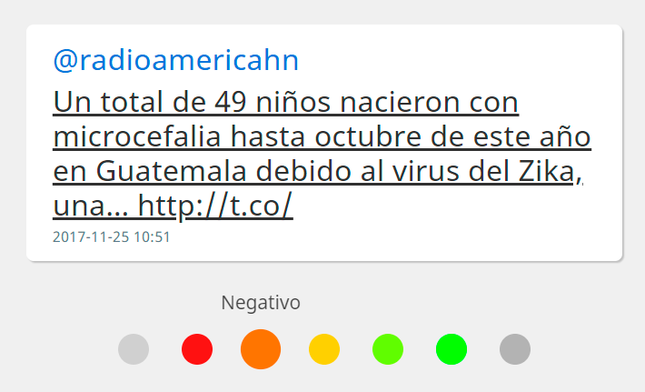
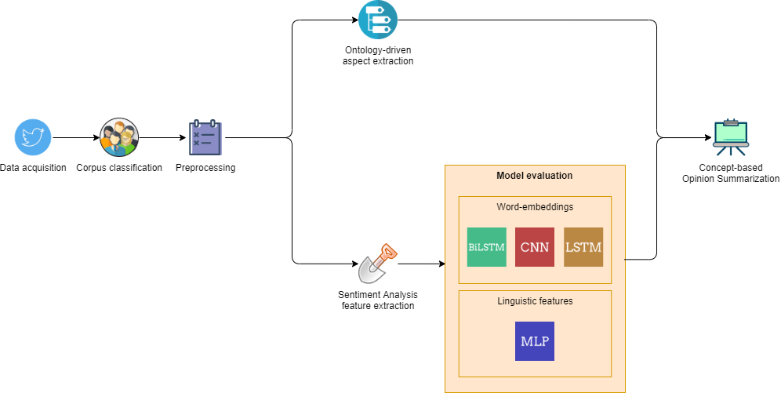
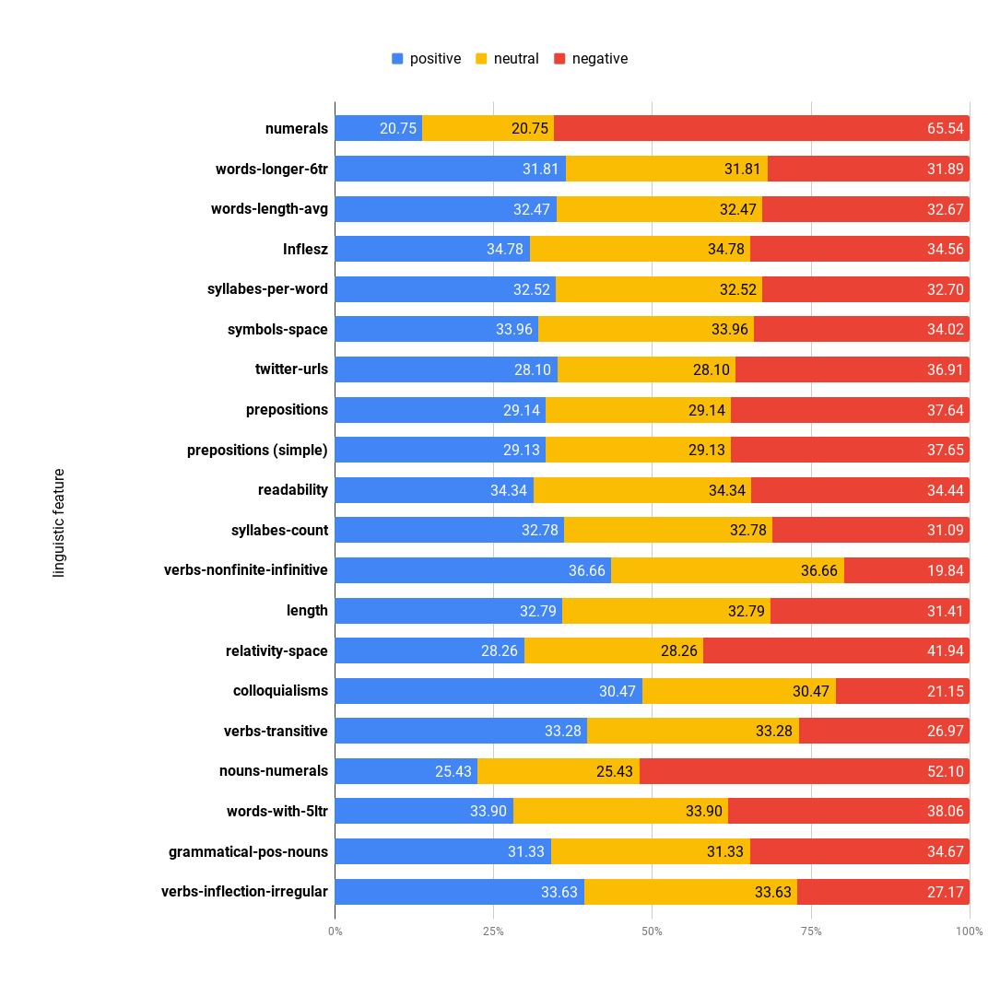
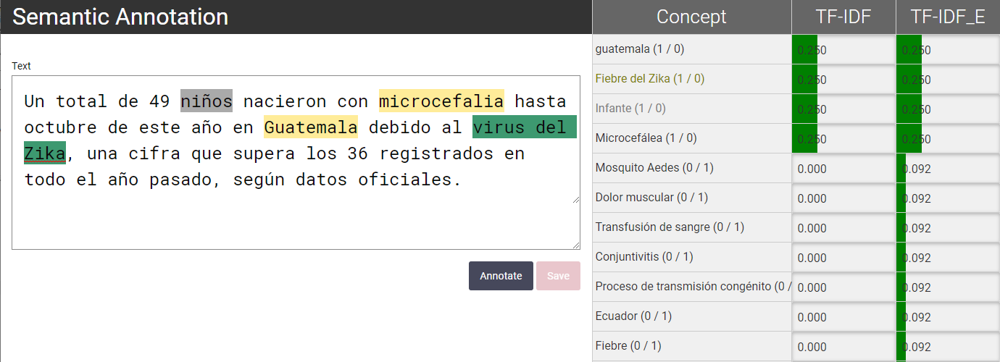
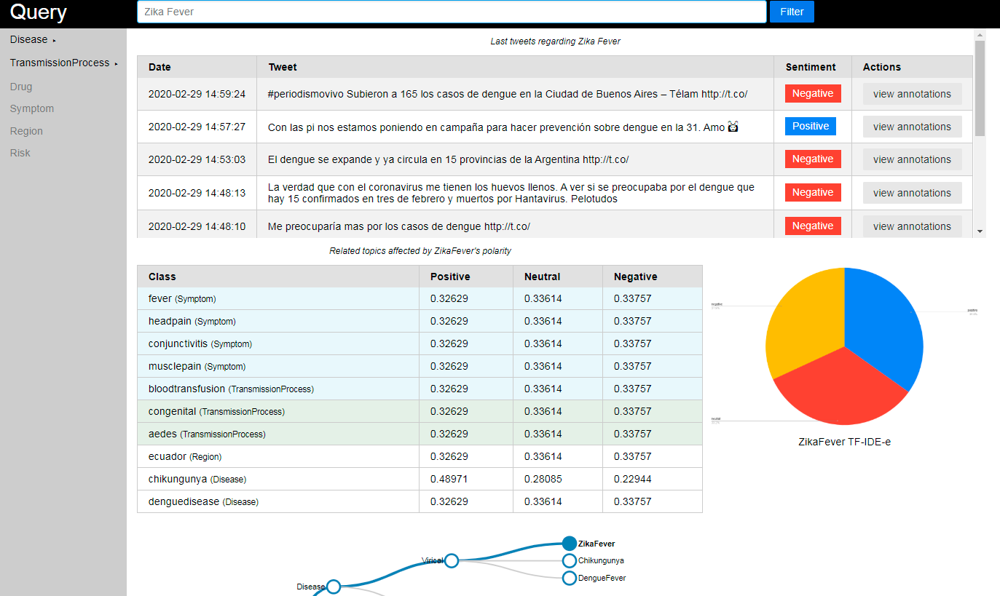

# Spanish-Infodemia-ABSA-2020
## Ontology-driven Aspect-Based Sentiment Analysis of Infectious Diseases in Latin American Spanish  

## TL-DR: Highlights
- Introduction of **Spanish-Infodemia-ABSA-2020**, an ontology-driven corpus for **Aspect-Based Sentiment Analysis (ABSA)** on infectious diseases in Latin America.
- Tweets were collected and annotated around emerging infectious diseases including **Dengue, Zika, Chikungunya, Influenza, Yellow Fever**, etc.
- The annotation incorporates:
  - **Aspect identification** based on an infectious-disease ontology  
  - **Sentiment polarity** toward each aspect  
  - **General tweet polarity**
- Includes a domain ontology describing relevant **entities, symptoms, risk factors, transmission aspects, and preventive measures**.
- Evaluation of multiple ML/NLP models combining:
  - **Linguistic features**  
  - **Ontology-driven features**  
  - **Word embeddings (FastText)**  
- The ontology-enhanced models outperform classical approaches.

### Authors
- **José Antonio García-Díaz** — University of Murcia  
  [Google Scholar](https://scholar.google.com/citations?user=ek7NIYUAAAAJ) · [ORCID](https://orcid.org/0000-0002-3651-2660)

- **Mar Cánovas-García** — University of Murcia  

- **Ricardo Colomo-Palacios** — Østfold University College  
  [Google Scholar](https://scholar.google.es/citations?user=CpqizXUAAAAJ&hl=es) · [ORCID](https://orcid.org/0000-0002-1555-9726)

- **Rafael Valencia-García** — University of Murcia  
  [Google Scholar](https://scholar.google.com/citations?user=GLpBPNMAAAAJ) · [ORCID](https://orcid.org/0000-0003-2457-1791)  

> Affiliations:
> - *Departamento de Informática y Sistemas, Universidad de Murcia, Spain*  
> - *Faculty of Computer Sciences, Østfold University College, Norway*

## Publication
This repository accompanies the following article:

> **Ontology-driven aspect-based sentiment analysis classification: An infodemiological case study regarding infectious diseases in Latin America**  
> *Future Generation Computer Systems*, Volume 114, 2021, Pages 506–518.  
> https://doi.org/10.1016/j.future.2020.08.032

---

## Abstract
Public health surveillance increasingly leverages social media data to monitor outbreaks, misinformation, and public attitudes toward infectious diseases. However, analyzing health-related content in Spanish presents linguistic challenges and requires domain knowledge. This work proposes an **ontology-driven approach** to Aspect-Based Sentiment Analysis (ABSA) applied to infectious diseases of major relevance in Latin America. We introduce a domain ontology capturing disease entities, symptoms, transmission modes, treatments, and preventive actions, and we annotate a corpus of Spanish tweets with aspects and sentiment polarity. A hybrid machine learning approach combining **linguistic features**, **ontology-driven features**, and **word embeddings** is evaluated. Results show that ontology-enriched models significantly outperform baseline approaches, demonstrating the importance of domain semantics for infodemiological analysis.

---


## Dataset: Spanish-Infodemia-ABSA-2020
This dataset contains Spanish tweets referring to infectious diseases relevant in Latin America, annotated for **aspect-based sentiment analysis**. Each tweet includes a Global sentiment polarity. The aspect terms have been extracted using an ontology of disease-related entities, covering diseases such as COVID, Dengue, Zika, Chikungunya, Influenza, and Yellow Fever among others.

Following Twitter TOS, the dataset is distributed as **tweet IDs plus annotation files**.

Download links (IDs + annotations + ontology):
https://pln.inf.um.es/corpora/zika/zika-spanish-2020.rar

An example of the dataset is shown below: 
<p align="center">
  
</p>


## Evaluation

The following pipeline illustrates the workflow followed in the study:

<p align="center">
  
</p>

1. **Data acquisition** from Twitter  
2. **Corpus classification and preprocessing**  
4. **Feature extraction** for sentiment classification  
5. **Model evaluation** using neural architectures (BiLSTM, CNN, LSTM) and MLP  

The integration of linguistic modelling and semantic normalization supports robust, domain-aware sentiment analysis for infectious disease surveillance.

The original article evaluates several hybrid models combining:

- **Linguistic features (LF)**  
- **Word embeddings (FastText)**  
- **Classical ML classifiers (SVM, RF, SMO)**  

### Key Findings
- The infectious-disease ontology proved essential for **identifying, organizing, and normalizing aspect categories**, ensuring consistent ABSA annotation across heterogeneous Spanish-language tweets from
  Latin America.
- The ontology enabled the extraction of medically relevant aspects (e.g., symptoms, transmission, prevention, treatments), which would be difficult to infer reliably using purely data-driven methods.
- Classification models based on **linguistic features** and **word embeddings** achieved strong performance in predicting sentiment toward each aspect, outperforming bag-of-words baselines.
- Word-embedding models (FastText) captured regional lexical variation across Latin American Spanish, improving the detection of disease-related terms and sentiment expressions.
- The combination of **ontology-driven aspect extraction** with **linguistic + embedding-based classifiers** provides a robust pipeline for infodemiological analysis on social media.

### Linguistic Feature Distribution Across Sentiment Classes
<p align="center">

</p>

This figure shows the distribution of linguistic features across the three sentiment classes (**positive**, **neutral**, **negative**). It provides insight into how specific textual characteristics—such as numerals, syllable count, prepositions, verb types, or readability—vary depending on the user’s expressed attitude. Negative tweets often exhibit higher proportions of emotionally charged or structurally complex features, while positive and neutral tweets tend to remain more homogeneous. This analysis supports the design of feature-based sentiment classification models used in the study.

To observe the relation between the concepts of the ontology, we design a tool that highlights ontology-mapped concepts directly within tweet text, showing how domain knowledge is used to identify aspects relevant to infectious diseases. It also provides TF-IDF and TF-IDF_E weights for each concept, supporting both annotation and feature
analysis workflows. 

<p>Ontology-based highlighting of concepts and TF-IDF scoring for semantic enrichment.</p>
<p align="center">

</p>


### Query Interface for Aspect-Based Sentiment Exploration
<p align="center">

</p>

This interface enables interactive exploration of tweets related to infectious diseases. Users can filter tweets by disease or aspect category and inspect sentiment predictions at the tweet and aspect levels. 

The system also displays related concepts (e.g., symptoms, transmission processes, regions) along with their **positive/neutral/negative** sentiment scores.  
This visualization demonstrates how ontology-driven aspect extraction enhances interpretability and supports infodemiological monitoring.

### Acknowledgments
This work has been supported by the *Spanish National Research Agency (AEI)* and the *European Regional Development Fund (FEDER/ERDF)* through projects **KBS4FIA (TIN2016-76323-R)** and **LaTe4PSP (PID2019-107652RB-I00)**. 
In addition, José Antonio García-Díaz has been supported by *Banco Santander* and *University of Murcia* through the **Doctorado industrial programme**.


### Citation
```
@article{garcia2020ontology,
  title={Ontology-driven aspect-based sentiment analysis classification: An infodemiological case study regarding infectious diseases in Latin America},
  author={Garc{\'\i}a-D{\'\i}az, Jos{\'e} Antonio and C{\'a}novas-Garc{\'\i}a, Mar and Valencia-Garc{\'\i}a, Rafael},
  journal={Future Generation Computer Systems},
  volume={112},
  pages={641--657},
  year={2020},
  publisher={Elsevier}
}
```


